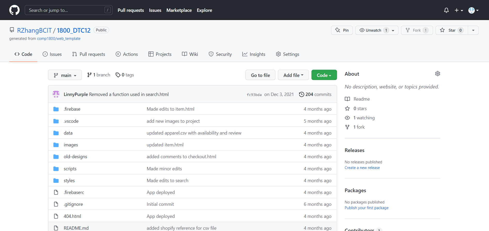

# Forking and Cloning Repositories using SSH Keys

1 ) To clone a repository from GitHub using SSH Keys, first go to the repository your wish to clone, which should look something like this:

2 ) From here, click on the green code button, highlighted below in red, and select the "SSH" option, outlined in blue, from the dropdown list.

3 ) In this window, click the double windowed copy symbol, underlined in green in the picture below, or highlight the link, underlined in red below, and copy it by pressing and holding down the "ctrl" key and then pressing the "c" key.

4 ) Once you have copied the link, you can now clone the repository using the link and your method of choice, such as PyCharm or the command line.