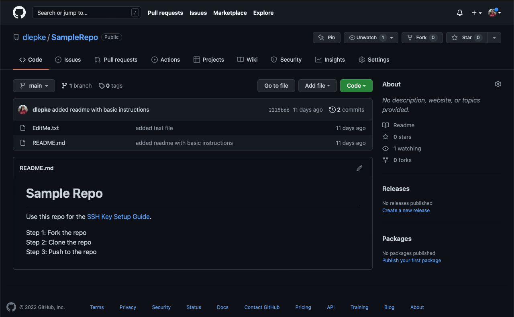
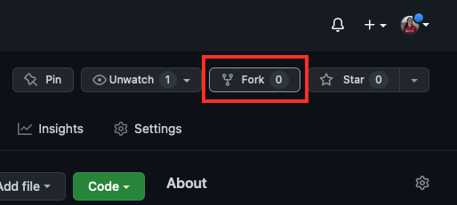
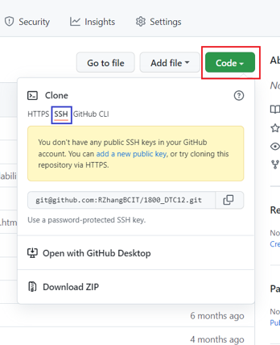
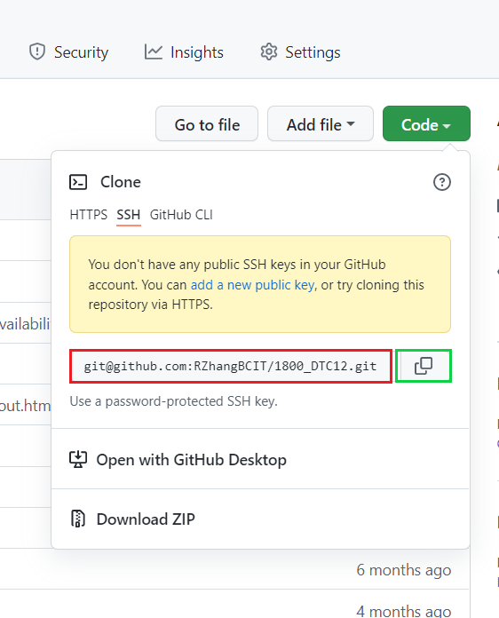
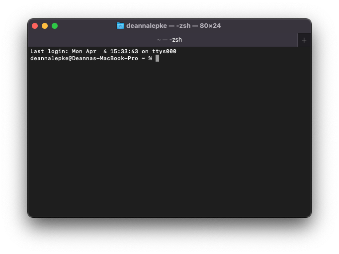

# Forking and Cloning Repositories using SSH Keys

In this mini-guide, we're going to fork [a sample repository we've prepared to practice with](https://github.com/dlepke/SampleRepo), then clone it to your local device.  

In the [next step,](https://dlepke.github.io/Deanna-Wilson-Ray/docs/UsingSSHWithGit/pushgit/) we will guide you through pushing to this repository.

## Step 1: Go to the desired GitHub repository
To clone a repository, first navigate to the [GitHub repository](https://github.com/dlepke/SampleRepo).



## Step 2: Fork the repository
1) Select the Fork button in the top right corner of the page.



2) If you have multiple destinations available on GitHub, you will be asked where to fork the repository. Please select your preferred location for the repository.


## Step 3: Copy the SSH link
Now that you've forked the sample repository to your own account, you can clone your own version of the repository to your local device.

On the repository page in GitHub, click on the green code button, highlighted below in red, and select the "SSH" option, outlined in blue, from the dropdown list.



In this window, click the double windowed copy symbol, outlined in green in the picture below. This will copy the link outlined in red to your clipboard.



## Step 4: Clone the repository to your IDE of choice
1) Open Terminal



2) Navigate to the directory you would like to clone the sample repository into.

Upon opening Terminal, you will automatically be in the root directory (denoted by '~'). We recommend you clone the repository to your Desktop; you can navigate to your Desktop in Terminal by entering the following command:

```
cd Desktop
```

c. Enter the following command into Terminal:

```
git clone (your GitHub clone link here)
```

Make sure you replace (your GitHub clone link here) with the link you copied from your GitHub repository page in Step 3. 

d. Congratulations! You have now successfully cloned your version of the SampleRepo to your local device.

