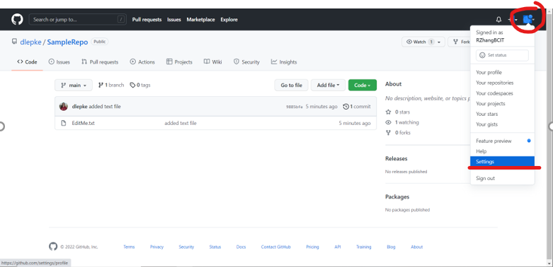
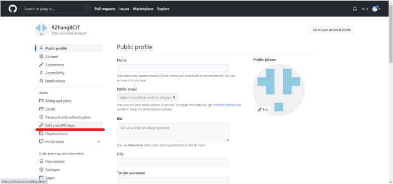
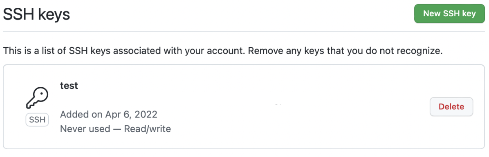

# Adding an SSH Key to Your GitHub Account

Now that you have generated an SSH key and linked it to your device, it is time to add it to your GitHub account.

1a ) First, log into your GitHub account at [GitHub.com](https://github.com/login).

1b ) If you do not currently own a GitHub account, one can be made [here](https://github.com/signup).

1c ) Upon logging in, you will be taking to you GitHub home page, which will look something like this: 

2a ) In the top right corner, click the little circle profile icon, and select "Settings" from the drop down list, as pictured below: 

2b ) This will take you to your profile page, which should be similar to the following: 

3a ) From here, click the "SSH and GPG Keys" option from the column on the left, like this: 

3b ) Doing so should bring you to this page: 

4a ) Next, Click the green button in the top right labelled "New SSH Key", which looks like this: 

4b ) Doing so should take you to a page that looks similar to this: 

5 ) Here you should input the SSH key you generated previously [see here for instructions on how to generate an SSH key](INSERT LINK HERE). You can also add a title to make distinguishing between keys easier.

6 ) Once you are done, click the green "Add SSH Key" button to add your newly generated key to GitHub 

7 ) Clickin the "Add SSH Key" button will take you to a page prompting you to authenticate your credentials by entering your password again. Do so, and you should be taken back to the "SSH and GPG Keys" page from step 3b. However, this time, you should be able to see your newly added SSH key in the field under "SSH Keys", like the picture below. 

Congratulations! You have now added an SSH key to your GitHub account, and are ready to start [cloning repositories with it](/docs/sshandgit/forkandclone).