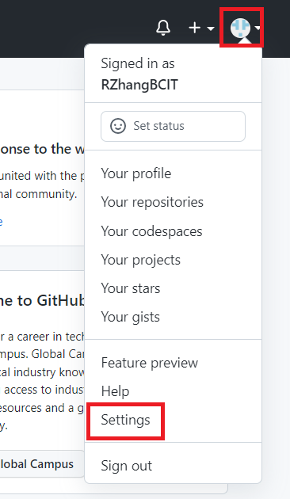
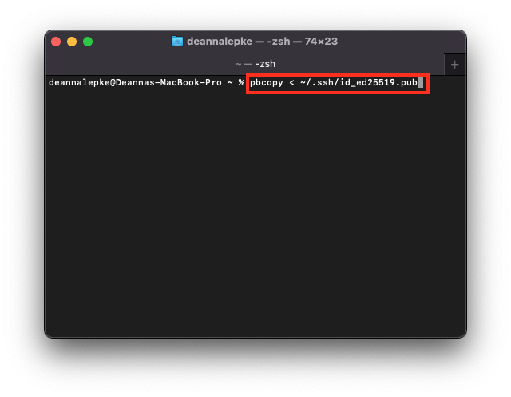

# Adding an SSH Key to Your GitHub Account

Now that you have generated an SSH key and you have linked it to your device, the next step is adding it to your GitHub account.

## Step 1: Log into your GitHub Account

If you are not already signed into your GitHub account, log in at [GitHub.com](https://github.com/login).

|  | If you do not currently have a GitHub account, you can make one [here](https://github.com/signup). |

Once you've logged in, you will be taken to the GitHub home page, which will look something like this:

## Step 2: Navigate to your account settings page
In the top right corner, click the little circle profile icon, and select "Settings" from the drop down list, as pictured below:

This will take you to your profile page, which should be similar to the following:

## Step 3: Go to the SSH Keys page
Click the "SSH and GPG Keys" option from the column on the left, like this:

Doing so should bring you to this page:

## Step 4: Add a new SSH key

Now, we add the SSH key you generated earlier to your GitHub account.  

If you no longer have this key available, you can enter the following command into Terminal to copy it into your clipboard again:  

1) Click the green button in the top right labelled "New SSH Key", which looks like this:

2) This will take you to a page that looks similar to this:  
  
  

3) Here you should input the SSH key you generated previously [see here for instructions on how to generate an SSH key](https://dlepke.github.io/Deanna-Wilson-Ray/docs/settingUpSSH/generateSSHKey/)

4) You can also add a title; this will help identify which device that SSH key is linked to

5) Once you are done, click the green "Add SSH Key" button to add your newly generated key to GitHub 

## Step 5: Authenticate your account credentials
Clicking the "Add SSH Key" button will take you to a page prompting you to authenticate your credentials by entering your password again.  

Once you've done this, you should be taken back to the "SSH and GPG Keys" page from Step 3. However, this time, you should be able to see your newly added SSH key in the field under "SSH Keys", like the picture below.

## Congratulations!
You have now added an SSH key to your GitHub account, and are ready to start [cloning repositories with it](https://dlepke.github.io/Deanna-Wilson-Ray/docs/UsingSSHWithGit/forkandclone/).