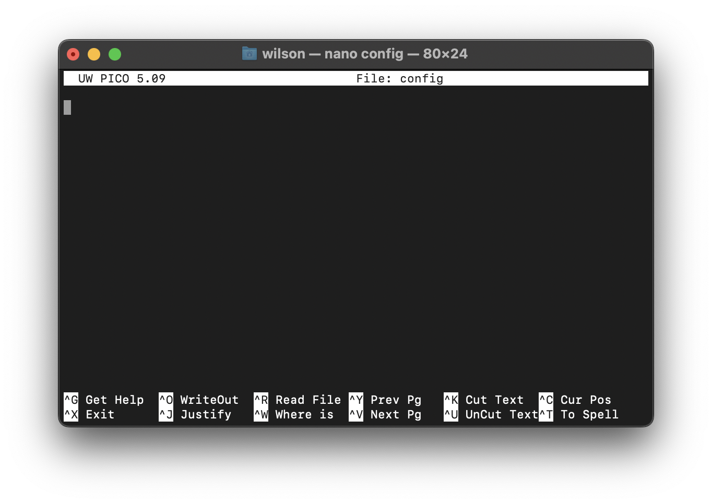
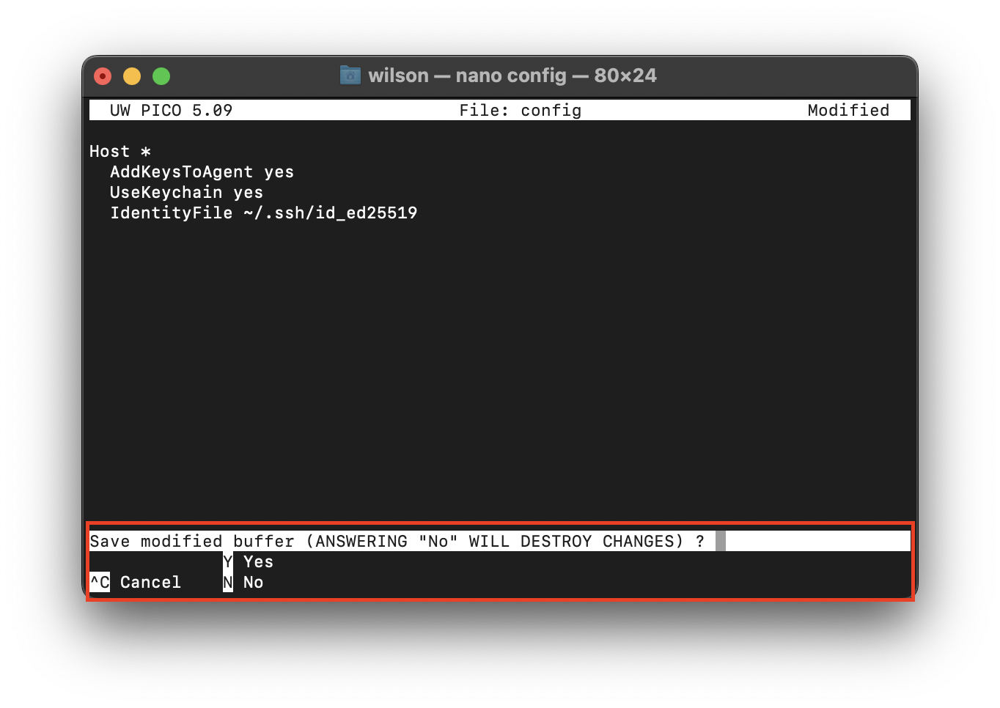

# Add your SSH Key to your local device

First, let's do a quick check of what we've done so far.

## Quick Status Check
1. [Have you checked for existing SSH keys on your device?](https://dlepke.github.io/Deanna-Wilson-Ray/docs/settingUpSSH/checkforSSH/)
2. [Have you generated an SSH key on your device?](https://dlepke.github.io/Deanna-Wilson-Ray/docs/settingUpSSH/generateSSHKey/)
|  | If you already had an existing SSH key, this step is not necessary for you |  
3. [Do you know where your SSH key is stored?](https://dlepke.github.io/Deanna-Wilson-Ray/docs/settingUpSSH/generateSSHKey/#3-select-a-file-to-save-your-new-ssh-key-in)

If you aren't sure what any of this means, please go back to the [introduction](https://dlepke.github.io/Deanna-Wilson-Ray/) to get familiar with what you'll need and to make sure you start off on the right foot.

This guide assumes that your SSH keys are stored in the default location on your mac. If they are stored elsewhere, adjust any commands that relate to their location accordingly.

## Step 1: Boot Up your SSH Agent
Let's open up a new terminal window on your mac and type in the following command:

`eval "$(ssh-agent -s)"`

Note: You may need to enter in a slightly different command depending on your environment. If you have repeated issues with this step, please refer to our [troubleshooting guide](https://dlepke.github.io/Deanna-Wilson-Ray/docs/troubleshooting/).

You'll know you've done this step correctly when the terminal outputs something like `Agent pid 111111` (the number will vary).

## Step 2: Set Up Your SSH Config File
Now that you've made your SSH Key, you'll need a way to tell your SSH Agent it exists so that it can manage it for you.

This is done through something called a config file.

Check if you already have a config file on your computer. Enter the following command on your terminal window:

`open ~/.ssh/config`

|  | This command assumes the default location for ssh keys is being used |

If you receive an error along the lines of "The file does not exist", move on to step 3. If it exists, please refer to step 4.

## Step 3: Make A Config File
Make a new config file in your default ssh location. Enter the following command on to your terminal:

`touch ~/.ssh/config`

|  | This command assumes the default location for ssh keys is being used.|

This will create a new config file in your ssh directory. Now, if you enter `ls -al ~/.ssh` you should see your brand new config file in the directory.

## Step 4: Edit Your Config File
Now that you're sure you've got a config file, we can add your new SSH key to it.

In doing so, we'll be telling your SSH-agent the details of your private keys to save you from entering them manually when you need them.

### Step 4a: Open your config file
To edit your config file, we'll first need to open it. You can use your preferred text editor to do so, or enter the following command into your terminal:

`nano ~/.ssh/config`

|  | This command assumes the default location for ssh keys is being used.|

This will open your command-line editor and allow you to make changes directly through the terminal window. If you open a brand new config file, you should see something like this:



Here, you can type notes as usual, but do keep in mind that, just like your terminal, your only way of interacting with Nano is through your keyboard (no cursors or clicking, here!).

A few important keyboard shortcuts to keep in mind:

|On-Screen Key Shortcut|keys|What it does|
|-----|-----|-----|
| ^X | control + "X" key | Pressing these keys allow you to quit the program. You will be prompted to save any progress upon doing so.|
| ^G | control + "G" key | This will take you to documentation that further outlines nano's features and uses |

### Step 4b: Edit your config file
Add the following text to your config file:

```
Host *
  AddKeysToAgent yes
  UseKeychain yes
  IdentityFile ~/.ssh/id_ed25519
```  

|  | If you opted not to use a passphrase when generating your SSH key, omit the 'UseKeychain' line. |

If you are using nano, you can copy and and paste this text into your config file with command+C and command+V, respectively.

### Step 4c: Save and close your config file
Now that the necessary changes have been made, save and close your config file.

In Nano, press the control + 'X' keys begin the exit process. Upon doing so, you should see the following prompt:



Press the 'Y' key on your keyboard to accept your changes. Nano will then ask you to confirm which file you wish to write the changes in to. Press the 'Return' key.

Congratulations! You have just used Nano to edit and save a text file. This barely scratched the surface of Nano's features. If you want a more indepth, beginner friendly introduction you can click [here](https://www.hostinger.com/tutorials/how-to-install-and-use-nano-text-editor).

## Step 5: Add your SSH private key to the SSH-Agent
Now that your SSH-Agent will know what to do with your new SSH Key, we can formally add it to your agent.

Return to your terminal and enter in the following command:

`ssh-add --apple-use-keychain ~/.ssh/id_ed25519`  


|  | This command assumes the default location for ssh keys is being used |  
|  | If you're version of Mac OS predates 12.0, you may need to replace the '--apple-use-keychain' flag with '-K'.|

Congratulations! You have now generated and added a new SSH key to your device. You can now add it to your Github Account.

## Next: [Add SSH Key to your Github Account.](https://dlepke.github.io/Deanna-Wilson-Ray/docs/settingUpSSH/SSHinGithub/)