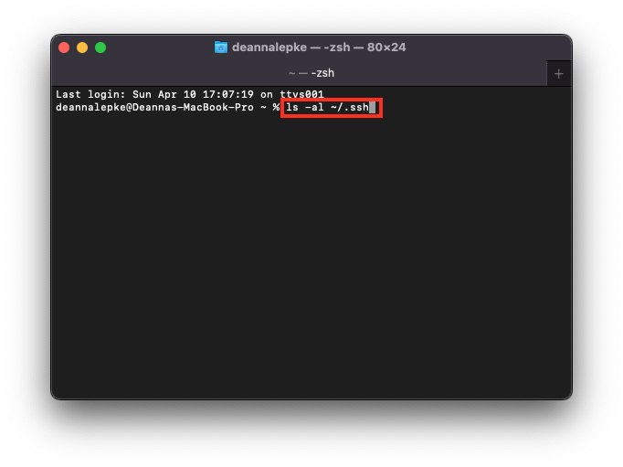
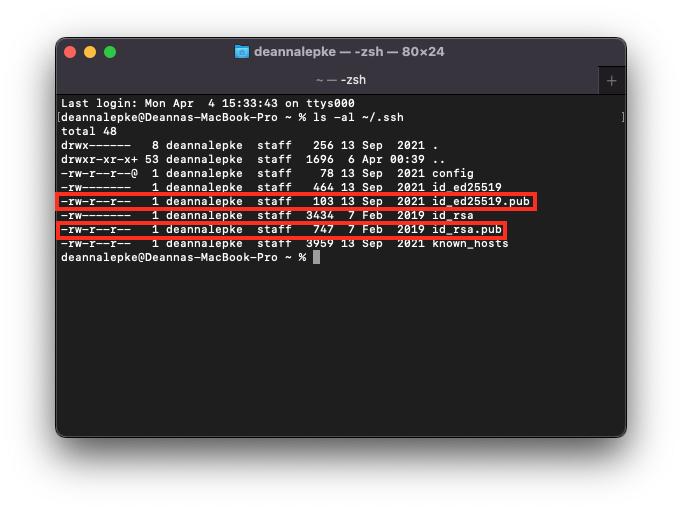

# Check For Existing Public SSH Key

Before beginning this guide, you should first check if your device already has a public SSH key set up. You can do this by following the guide below.

|   | If you already have a public SSH key set up on your device, please begin this guide at [Step 3: Adding An SSH Key to GitHub.](https://dlepke.github.io/Deanna-Wilson-Ray/docs/settingUpSSH/SSHinGithub/) |  

## Step 1: Open Terminal

On your Mac device, open the Terminal app. It should look something like the following:

You should start in the root directory.

## Step 2: Check for existing keys

In Terminal, enter the following command:  

`$ ls -al ~/.ssh`

## Step 3: Check for any of the following file names

After typing in the command from Step 2, if you see any of the following file names, you may already have an SSH key set up:

* id_rsa.pub
* id_ecdsa.pub
* id_ed25519.pub

These files would appear like the following:

|   | If you receive an error that ~/.ssh doesn't exist, then you do not have an existing SSH key pair. |  

## Next: [Generate a new SSH key](https://dlepke.github.io/Deanna-Wilson-Ray/docs/settingUpSSH/generateSSHKey/)