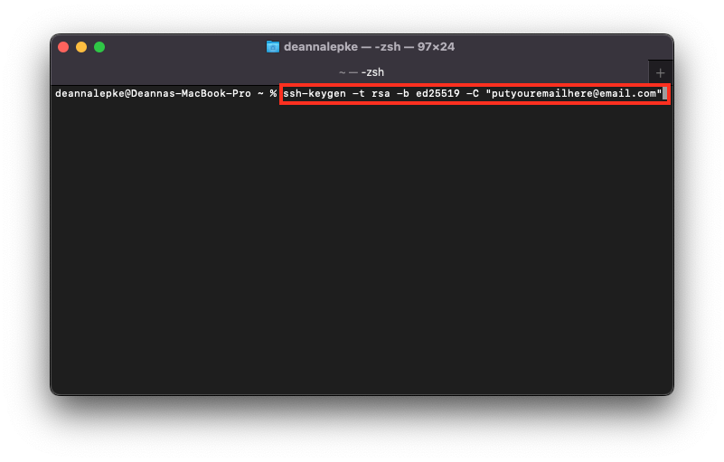

# Generate A New SSH Key

## 1. If you haven't already, [check if you already have a public SSH key set up.](https://dlepke.github.io/Deanna-Wilson-Ray/docs/settingUpSSH/checkforSSH/)  

If you have already generated a public SSH key, please skip to the next step: [Adding a public SSH key to your local device.](https://dlepke.github.io/Deanna-Wilson-Ray/docs/settingUpSSH/addnewSSH/)  

Follow these steps to generate a new SSH key (which will later be added to your device and your GitHub account).  

## 1. Open Terminal  
On your Mac device, open the Terminal app.

## 2. Generate a new SSH key:  

<!-- ran into "bits has bad value" -->

Enter the following into your Terminal:

`ssh-keygen -t ed25519 -C "your_email@example.com"`  

(this screenshot needs updating)

|  | This will generate a new SSH key on your device, using the Ed25519 algorithm. You can learn about this algorithm [here](https://en.wikipedia.org/wiki/EdDSA#Ed25519). |  

## 3. Select a file to save your new SSH key in

When you're prompted to enter a file name, you can simply press Return (or Enter on a non-Apple keyboard).  

This will accept the default file location for your new SSH key.

[ screencap here ]

## 4. Select a passphrase

When you're prompted to "Enter passphrase", you can either:  

* Enter a secure passphrase (you will have to type this in every time you use your SSH key), or  
* Immediately press Return on your keyboard to skip and have no passphrase

[ enter screencap here ]

## Next: [Add your new SSH key to your local device.](https://dlepke.github.io/Deanna-Wilson-Ray/docs/settingUpSSH/addnewSSH/)

